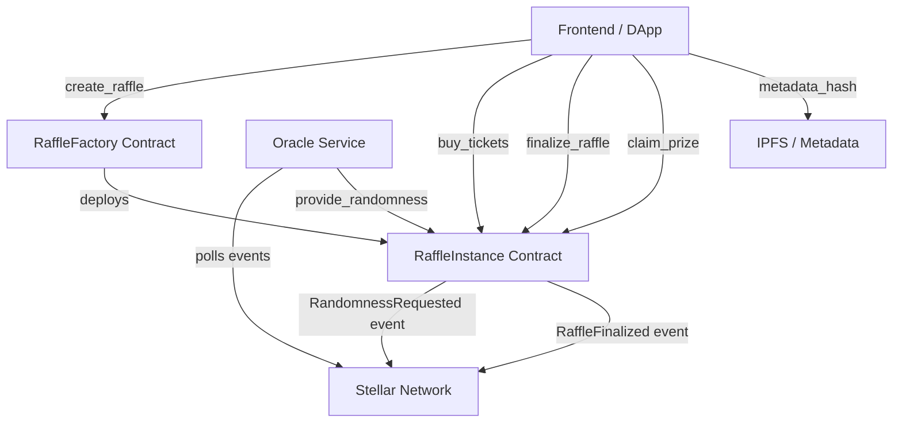
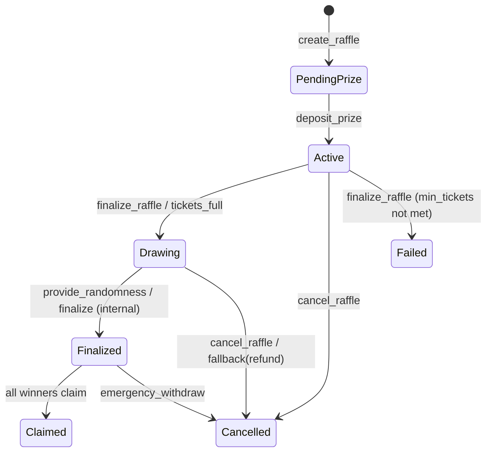

# Tikka Architecture

This document explains how the factory, raffle instances, oracle, and clients interact.

## Factory -> Instance -> Oracle Flow

### Flow explanation

1. A creator calls `create_raffle` on the factory with `RaffleConfig`.
2. The factory deploys a new raffle instance and returns the new instance address.
3. Users buy tickets directly on the raffle instance contract.
4. When finalization starts, the instance emits randomness request events to the network.
5. The oracle service polls those events and calls `provide_randomness` back on the instance.
6. The instance finalizes winners, emits finalization events, and winners claim prizes.

## RaffleStatus State Machine

### State notes

- `PendingPrize`: created but not funded yet.
- `Active`: funded and selling tickets.
- `Drawing`: draw execution in progress.
- `Finalized`: winners are locked and can claim.
- `Claimed`: terminal state when all claims are complete.
- `Cancelled` / `Failed`: terminal non-success states.
